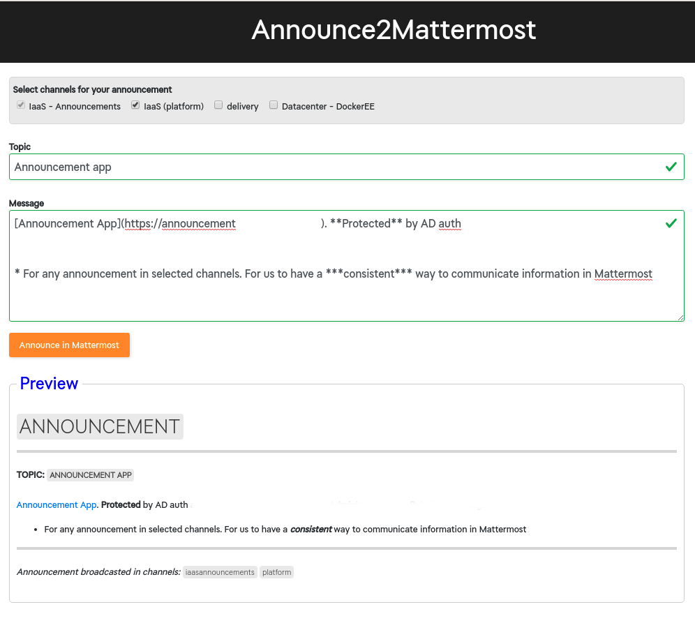

### announce2mattermost
***`Author: Jon Svendsen`***

#### What it is
*A Simple webform that posts an 'announcement' to a Mattermost channels*

* It have a standalone 'route' that all POST requests are sent as json formatted payload. Also meaning that you dont't need this GUI to do your announcements.

* Your request gets formatted as am announcement and POST:ed to pre configured Mattermost channels.

**NOTE:** Any post to "backend" requires auth.

#### GUI


#### CURL
```
curl -s -XPOST https://announcement.example.com/api/v1/mattermost/j0nixtest,@jonas -d '{"topic":"First message with the announcement app","message":"**This is just a test.** Hope it works! "}' -H "content-type: application/json" -u 'j0nix:pAzzw0rd' | jq .
{
  "success": [
    {
      "channel": "j0nixtest",
      "reply": "ok"
    },
    {
      "channel": "@jonas",
      "reply": "ok"
    }
  ],
  "fail": null
}
```

#### Announcement text format
```
@channel
## `ANNOUNCEMENT`
***
**TOPIC:** **`<THE-TOPIC>`**
<the-announcement-message>
***
*Announcement broadcasted in channels:* <channels-listed>
```

#### Application requires the following environment variables to be set
***HOOKURL***, Mattermost hook URL 

***BINDUSERNAME***, service account user. ***Ex)*** `svc_f2m@AD.EXAMPLE.COM`

***BINDPASSWORD***, The password

***LDAPSERVER***, AD server address

***LDAPBASEDN***, Starting point for LDAP search. ***Ex)*** `dc=ad,dc=example,dc=com`


### When going k8s
Have your sensetive environment variables in k8s secrets
#### Create secrets

**Ex)**

create a `secrets.yaml` file with following data

```
apiVersion: v1
kind: Secret
metadata:
  namespace: chplatform
  name: announce2mattermost
type: Opaque
data:
  HOOKURL: bXlzcWNyZXQ=
  BINDUSERNAME: bXlzcWNyZXQ=
  BINDPASSWORD: bXlzcWNyZXQ=
```

Then apply to your namespace

```
kubectl apply -f secrets.yaml
```

* create your secrets base64 value by `echo "mysqcret" | tr -d \\n | base64 -w 0 && echo`

#### Use secrets in your Deployment
**Ex)**
```
    ...
    ...
    spec:
      containers:
      - name: announce2mattermost
        image: myregistry.example.com/myname/announce2mattermost:latest
        ports:
        - containerPort: 8080
        resources:
          limits:
            cpu: 400m
            memory: 361Mi
        env:
          - name: BINDPASSWORD
            valueFrom:
              secretKeyRef:
                name: announce2mattermost
                key: BINDPASSWORD
          - name: LDAPSERVER
            value: "ad.example.com:636"
          ...
          ...
```

/j0nix
